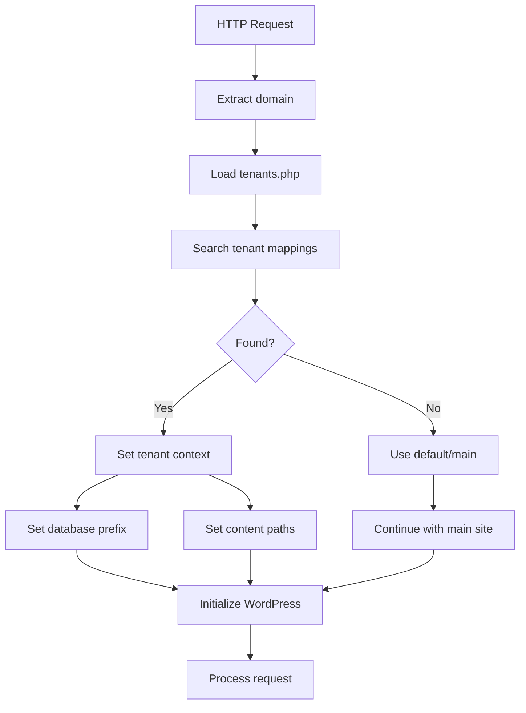

# GrabWP Tenancy

Multi-tenant WordPress solution with shared MySQL and domain-based routing.

## Overview

GrabWP Tenancy provides the foundation for multi-tenant WordPress with essential isolation features. This plugin focuses on cost-effective multi-tenancy with shared resources and basic tenant separation.

**Available on WordPress.org**: [Download GrabWP Tenancy](https://wordpress.org/plugins/grabwp-tenancy/)

## Requirements

- WordPress 5.0+
- PHP 7.4+
- Tested up to WordPress 6.8

## Quick Start

### Installation

#### From WordPress.org (Recommended)
1. Go to **Plugins > Add New** in your WordPress admin
2. Search for "GrabWP Tenancy"
3. Click **Install Now** and then **Activate**
4. Add to `wp-config.php`:
   ```php
   require_once __DIR__ . '/wp-content/plugins/grabwp-tenancy/load.php';
   ```

#### Manual Installation
1. Download from [WordPress.org](https://wordpress.org/plugins/grabwp-tenancy/)
2. Upload `grabwp-tenancy` to `/wp-content/plugins/`
3. Activate the plugin
4. Add to `wp-config.php`:
   ```php
   require_once __DIR__ . '/wp-content/plugins/grabwp-tenancy/load.php';
   ```

## Architecture

### File Structure
```
wp-content/
├── uploads/
│   └── grabwp-tenancy/
│       ├── tenants.php      # Domain mappings
│       └── {tenant_id}/
│           └── uploads/     # Isolated uploads per tenant
└── plugins/
    └── grabwp-tenancy/      # Base plugin
```

### Database Architecture
- Shared MySQL with tenant prefixes (`{tenant_id}_`)
- Cost-effective tenant isolation using unique table prefixes

### Content Isolation
- Shared themes and plugins
- Isolated uploads per tenant (`wp-content/uploads/grabwp-tenancy/{tenant_id}/uploads`)

## Tenant Structure

```php
$tenant = [
    'id' => 'abc123',           // 6-char alphanumeric
    'domains' => [              // Array with primary first
        0 => 'domain1.local',
        1 => 'domain2.local'
    ],
    'status' => 'active',       // active/inactive
    'created_date' => timestamp
];
```

## Domain Mapping

```php
$tenant_mappings = [
    'abc123' => [
        0 => 'tenant1.grabwp.local',
    ],
    'def456' => [
        0 => 'tenant2-0.grabwp.local',
        1 => 'tenant2-1.grabwp.local'
    ]
];
```

## Domain Mapping Flowchart



## Development

### Naming Conventions
- **Functions**: `grabwp_tenancy_` prefix
- **Classes**: `GrabWP_Tenancy_` prefix
- **Constants**: `GRABWP_TENANCY_` prefix


## License

GPLv2 or later 

