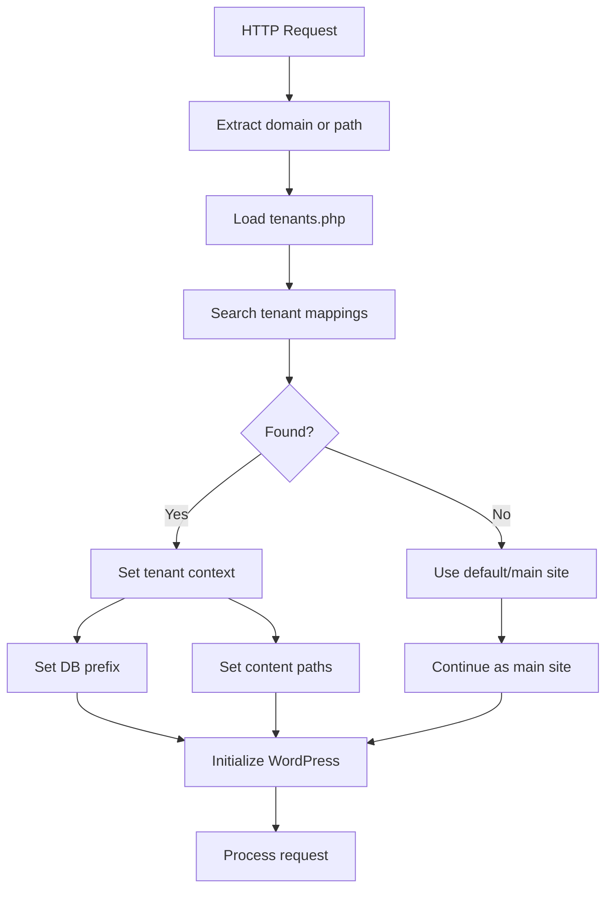

# GrabWP Tenancy

> **WordPress Multisite Alternative** — Multi-tenant WordPress with shared MySQL, domain and path routing, and isolated uploads. No Multisite complexity. No per-site server overhead.

**🌐 Website & Documentation: [grabwp.com](https://grabwp.com)**

[WordPress](https://wordpress.org/plugins/grabwp-tenancy/)
[PHP](https://wordpress.org/plugins/grabwp-tenancy/)
[License](https://www.gnu.org/licenses/gpl-2.0.html)
[WordPress.org](https://wordpress.org/plugins/grabwp-tenancy/)

---

## What Is GrabWP Tenancy?

GrabWP Tenancy turns a single WordPress installation into a multi-tenant platform — perfect for freelancers, agencies, and SaaS builders who need to host multiple client sites without spinning up separate servers.

- **No WordPress Multisite required** — avoids network admin complexity and shared-database risks
- **Shared MySQL with tenant prefixes** — cost-effective isolation, each tenant gets its own table prefix
- **Flexible routing** — domain-based *or* path-based (e.g., `yoursite.com/site/abc123`) with zero DNS changes
- **Isolated uploads** — each tenant's media is stored in a dedicated directory
- **Lightweight** — loads before WordPress core hooks for minimal overhead

## 📦 Download & Resources


| Resource         | Link                                                                                         |
| ---------------- | -------------------------------------------------------------------------------------------- |
| 📥 WordPress.org | [Plugin Directory](https://wordpress.org/plugins/grabwp-tenancy/) — official distribution    |
| 🌐 Documentation | [grabwp.com](https://grabwp.com) — complete guides and support                               |
| 💬 Support Forum | [WordPress.org Forum](https://wordpress.org/support/plugin/grabwp-tenancy/) — community help |
| 🐛 Issues        | [GitHub Issues](https://github.com/grabwp/grabwp-tenancy/issues) — bug reports               |
| ⭐ Reviews        | [Rate on WordPress.org](https://wordpress.org/plugins/grabwp-tenancy/#reviews)               |


---

## Core Features (Free)


| Feature                 | Details                                                           |
| ----------------------- | ----------------------------------------------------------------- |
| Shared MySQL            | Tenant isolation via unique table prefixes (`{tenant_id}_`)       |
| Separated Uploads       | Each tenant gets `wp-content/grabwp-tenancy/{tenant_id}/uploads/` |
| Domain Routing          | Map any custom domain to a tenant                                 |
| Path-Based Routing      | Host tenants on subdirectories — no DNS changes needed            |
| Shared Themes & Plugins | All tenants share the same extensions                             |
| Tenant Cloning          | Duplicate any tenant (or mainsite) including DB + files           |
| Admin Interface         | Full tenant CRUD with list table, edit, delete, clone             |
| Security Controls       | Hide plugin/theme management, disallow file edits per tenant      |
| One-click Setup         | Auto-install MU-plugin and `wp-config.php` loader from admin      |


---

## 🚀 Upgrade to Pro 

Need complete isolation for your client sites or Wordpress SaaS platform? **[GrabWP Tenancy Pro](https://grabwp.com/pro/)** takes you from shared infrastructure to per-tenant independence:

### Pro-Only Features


| Feature                                  | Description                                                                           |
| ---------------------------------------- | ------------------------------------------------------------------------------------- |
| **Dedicated MySQL or SQLite per tenant** | Complete data isolation — zero cross-tenant risk, no shared tables                    |
| **Full `wp-content` separation**         | Each tenant gets isolated themes, plugins *and* uploads                               |
| **AJAX Backup & Restore**                | 7-step backup and 8-step restore with real-time progress UI                           |
| **Cross-database migration**             | Move tenants freely between shared MySQL, dedicated MySQL, and SQLite                 |
| **Extension sync & management**          | Sync plugins/themes with filesystem; switch between symlink and copy installs         |
| **Broken symlink auto-repair**           | One-click detection and repair for broken plugin/theme symlinks                       |
| **Custom tenant data location**          | Store content anywhere — outside `wp-content/uploads` via settings or `wp-config.php` |
| **Per-tenant config files**              | Each tenant gets its own `wp-config.php`; new tenants inherit master defaults         |


### Pricing

**From $9.99/month** — all plans include every Pro feature.  
Use code `**EARLYBIRDPRO`** at checkout for **20% off**.

👉 **[Get GrabWP Tenancy Pro →](https://grabwp.com/pro/)**

---

## Requirements

- WordPress 5.0+ (tested up to 6.9)
- PHP 7.4+

## Quick Start

### Installation

#### From WordPress.org (Recommended)

1. Go to **Plugins > Add New** in your WordPress admin
2. Search for **"GrabWP Tenancy"**
3. Click **Install Now** then **Activate**
4. Add to `wp-config.php`:

```php
require_once __DIR__ . '/wp-content/plugins/grabwp-tenancy/load.php';
```

> The plugin's **Status page** provides a one-click auto-installer for both the MU-plugin and `wp-config.php` line.

#### Manual Installation

1. Download from [WordPress.org Plugin Directory](https://wordpress.org/plugins/grabwp-tenancy/)
2. Upload `grabwp-tenancy` to `/wp-content/plugins/`
3. Activate and follow the Status page setup wizard

> 📖 **Need help?** See the [complete documentation](https://grabwp.com) or the [support forum](https://wordpress.org/support/plugin/grabwp-tenancy/).

---

## Architecture

### File Structure

```
wp-content/
├── grabwp-tenancy/          # Tenant data (outside uploads for security)
│   ├── tenants.php          # Domain/path mappings
│   └── {tenant_id}/
│       └── uploads/         # Isolated uploads per tenant
└── plugins/
    └── grabwp-tenancy/      # Base plugin
```

### Database Architecture

- Shared MySQL with tenant prefixes (`{tenant_id}_`)
- Cost-effective isolation — no extra databases needed (Pro adds dedicated DB option)

### Tenant Structure

```php
$tenant = [
    'id'           => 'abc123',       // 6-char alphanumeric
    'domains'      => [               // Array, primary domain first
        0 => 'client1.example.com',
        1 => 'alias.example.com',
    ],
    'status'       => 'active',       // active | inactive
    'created_date' => 1714000000,
];
```

## Routing

Tenants can be served on custom domains **or** path-based subdirectories using the `nodomain.local` placeholder:

```php
$tenant_mappings = [
    'abc123' => ['tenant1.example.com'],
    'def456' => ['nodomain.local'],   // → yoursite.com/site/def456
];
```


```mermaid
flowchart TD
    A[HTTP Request] --> B[Extract domain or path]
    B --> C[Load tenants.php]
    C --> D[Search tenant mappings]
    D --> E{Found?}
    E -->|Yes| F[Set tenant context]
    E -->|No| G[Use default/main site]
    F --> H[Set DB prefix]
    F --> I[Set content paths]
    G --> J[Continue as main site]
    H --> K[Initialize WordPress]
    I --> K
    J --> K
    K --> L[Process request]
```


---

## FAQ

**Does this work with WordPress Multisite?**  
No — it's a standalone alternative. It provides multi-tenancy through routing and DB prefixes without Multisite's network admin overhead.

**Do I need a custom domain for every tenant?**  
No. Path-based routing lets you host tenants at `yoursite.com/site/{id}` with zero DNS changes.

**How is this different from WordPress Multisite?**  
Multisite shares one DB, one plugin set, and one theme set. GrabWP Tenancy gives each tenant separate table prefixes and separate uploads. [Pro](https://grabwp.com/pro/) adds dedicated databases and fully isolated `wp-content` per tenant — something Multisite cannot do.

**Can I manage 50+ client sites?**  
Yes. GrabWP Tenancy is built for agencies and freelancers. Pro adds per-tenant backup/restore for easy management at scale.

**Is it compatible with other plugins?**  
Most plugins work out of the box. Plugins that hardcode DB table names (without `$wpdb->prefix`) may need configuration.

---

## Development

### Naming Conventions

- Functions: `grabwp_tenancy_` prefix
- Classes: `GrabWP_Tenancy_` prefix
- Constants: `GRABWP_TENANCY_` prefix

### Contributing

- **Issues**: [GitHub Issues](https://github.com/grabwp/grabwp-tenancy/issues)
- **Pull Requests**: [GitHub PRs](https://github.com/grabwp/grabwp-tenancy/pulls)
- **Documentation**: [grabwp.com](https://grabwp.com)

---

## Changelog

### v1.0.9

- **Fix:** Tenant data directory moved to `wp-content/grabwp-tenancy/` (outside `uploads/`) — prevents direct web access; existing installs on the old path are preserved automatically
- **Fix:** Status page migration notice now references the correct new path
- **Fix:** Clone page hero buttons replaced with standard buttons
- **Enhance:** Admin bar `Plugins` / `Themes` nodes hidden on tenant sites when corresponding settings are enabled
- **Enhance:** Tenant create page — auto-suggested domain, new Clear button, fluid input width, improved layout
- **Enhance:** GrabWP Tenancy admin menu repositioned to the top of the sidebar
- **Change:** Default values for Hide Plugin Management and Hide Theme Management changed to `false` for fresh installs

### v1.0.8

- **New:** Tenant cloning — duplicate any tenant (or mainsite) to a new tenant with DB copy and file sync
- **New:** `GRABWP_MAINSITE_ID` (`__mainsite__`) constant for using mainsite as clone source
- **Enhance:** Mainsite domain detection supports localhost and LAN domains with no TLD
- **Fix:** Plugin asset URL resolution when the plugin directory is symlinked
- **Fix:** Tenant ID generation now guarantees uniqueness
- **Quality:** Normalised all source files to LF line endings

### v1.0.7

- Path-based routing, Status page UI, installer refactor, nonce security, autoloader fix

### v1.0.6

- Dedicated Status page, one-click MU-plugin and wp-config.php installers, admin notices

### v1.0.5 – v1.0.0

See [WordPress.org Changelog](https://wordpress.org/plugins/grabwp-tenancy/#developers) for full history.

---

## License

GPLv2 or later — see [LICENSE](https://www.gnu.org/licenses/gpl-2.0.html)

---

**Need enterprise isolation, dedicated databases, and per-tenant backups?**  
**[→ Upgrade to GrabWP Tenancy Pro](https://grabwp.com/pro/)** · From $9.99/month · Code `EARLYBIRDPRO` for 20% off