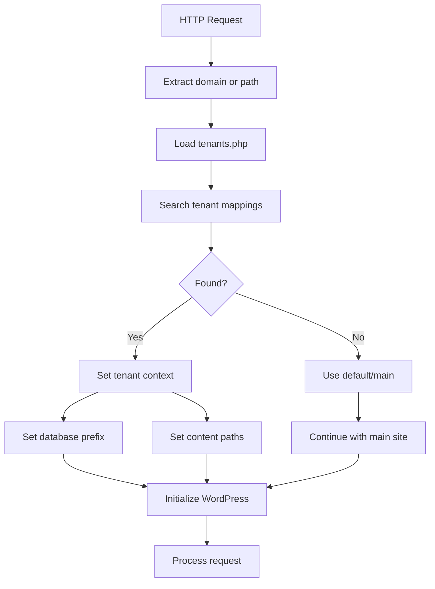

# GrabWP Tenancy

Multi-tenant WordPress solution with shared MySQL, offering both domain-based and path-based routing.

## Overview

GrabWP Tenancy provides the foundation for multi-tenant WordPress with essential isolation features. This plugin focuses on cost-effective multi-tenancy with shared resources and basic tenant separation. New in v1.0.8: **one-click tenant cloning** lets you spin up a new tenant from any existing tenant or the mainsite in seconds.

## 📦 Download & Resources

- **📥 Download**: [WordPress.org Plugin Directory](https://wordpress.org/plugins/grabwp-tenancy/) - Official plugin distribution
- **🌐 Documentation**: [Official Website](https://grabwp.com) - Complete guides and support
- **🐛 Issues & Support**: [WordPress.org Support Forum](https://wordpress.org/support/plugin/grabwp-tenancy/) - Community support
- **💻 Source Code**: [GitHub Repository](https://github.com/grabwp/grabwp-tenancy) - Development and contributions

## Requirements

- WordPress 5.0+
- PHP 7.4+
- Tested up to WordPress 6.9

## Quick Start

### Installation

#### From WordPress.org (Recommended)
1. Go to **Plugins > Add New** in your WordPress admin
2. Search for "GrabWP Tenancy"
3. Click **Install Now** and then **Activate**
4. Add to `wp-config.php`:
   ```php
   require_once __DIR__ . '/wp-content/plugins/grabwp-tenancy/load.php';
   ```

#### Manual Installation
1. Download from [WordPress.org Plugin Directory](https://wordpress.org/plugins/grabwp-tenancy/)
2. Upload `grabwp-tenancy` to `/wp-content/plugins/`
3. Activate the plugin
4. Add to `wp-config.php`:
   ```php
   require_once __DIR__ . '/wp-content/plugins/grabwp-tenancy/load.php';
   ```

> 📖 **Need help?** Check our [complete documentation](https://grabwp.com) or visit the [support forum](https://wordpress.org/support/plugin/grabwp-tenancy/).

## Architecture

### File Structure
```
wp-content/
├── uploads/
│   └── grabwp-tenancy/
│       ├── tenants.php      # Domain mappings
│       └── {tenant_id}/
│           └── uploads/     # Isolated uploads per tenant
└── plugins/
    └── grabwp-tenancy/      # Base plugin
```

### Database Architecture
- Shared MySQL with tenant prefixes (`{tenant_id}_`)
- Cost-effective tenant isolation using unique table prefixes

### Content Isolation
- Shared themes and plugins
- Isolated uploads per tenant (`wp-content/uploads/grabwp-tenancy/{tenant_id}/uploads`)

## Tenant Structure

```php
$tenant = [
    'id' => 'abc123',           // 6-char alphanumeric
    'domains' => [              // Array with primary first
        0 => 'domain1.local',
        1 => 'domain2.local'
    ],
    'status' => 'active',       // active/inactive
    'created_date' => timestamp
];
```

## Domain & Path Routing

Tenants can be routed either via distinct domains or via path-based routing using a predefined placeholder (`nodomain.local`) to access them at subdirectories like `/tenant1`.

```php
$tenant_mappings = [
    'abc123' => [
        0 => 'tenant1.grabwp.local',
    ],
    'def456' => [
        0 => 'nodomain.local' // Path-based routing example
    ]
];
```

## Routing Flowchart


```mermaid
flowchart TD
    A[HTTP Request] --> B[Extract domain or path]
    B --> C[Load tenants.php]
    C --> D[Search tenant mappings]
    D --> E{Found?}
    E -->|Yes| F[Set tenant context]
    E -->|No| G[Use default/main]
    F --> H[Set database prefix]
    F --> I[Set content paths]
    G --> J[Continue with main site]
    H --> K[Initialize WordPress]
    I --> K
    J --> K
    K --> L[Process request] 
```

## Development

### Naming Conventions
- **Functions**: `grabwp_tenancy_` prefix
- **Classes**: `GrabWP_Tenancy_` prefix
- **Constants**: `GRABWP_TENANCY_` prefix

### Contributing
- **Issues**: Report bugs and request features on [GitHub Issues](https://github.com/grabwp/grabwp-tenancy/issues)
- **Pull Requests**: Submit code improvements via [GitHub Pull Requests](https://github.com/grabwp/grabwp-tenancy/pulls)
- **Documentation**: Help improve docs on our [website](https://grabwp.com)

## Support & Community

- **📖 Documentation**: [grabwp.com](https://grabwp.com) - Complete guides and tutorials
- **💬 Support Forum**: [WordPress.org Support](https://wordpress.org/support/plugin/grabwp-tenancy/) - Community help
- **🐛 Bug Reports**: [GitHub Issues](https://github.com/grabwp/grabwp-tenancy/issues) - Technical issues
- **⭐ Rate Plugin**: [WordPress.org Reviews](https://wordpress.org/plugins/grabwp-tenancy/#reviews) - Share your experience

## Changelog

### v1.0.8
- **New:** Tenant cloning — duplicate any tenant (or mainsite) to a new tenant with DB copy and file sync
- **New:** `GRABWP_MAINSITE_ID` (`__mainsite__`) constant for using mainsite as clone source
- **Enhance:** Mainsite domain detection supports localhost and LAN domains with no TLD
- **Fix:** Plugin asset URL resolution when the plugin directory is symlinked
- **Fix:** Tenant ID generation now guarantees uniqueness
- **Quality:** Normalised all source files to LF line endings

### v1.0.7
- Path-based routing, status page UI, installer refactor, nonce security, autoloader fix

### v1.0.6
- Dedicated Status page, one-click MU-plugin and wp-config.php installers, admin notices

## License

GPLv2 or later 

